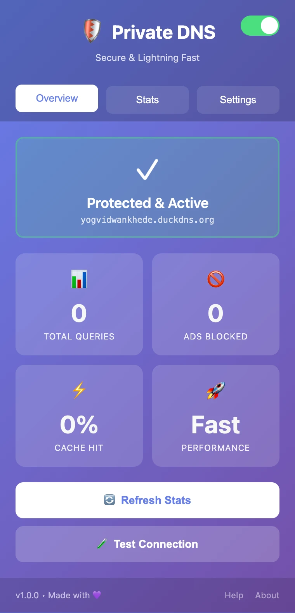

# 🛡️ Private DNS - Chrome Extension

Fast, secure, and private DNS resolver with ad-blocking and enhanced privacy protection.


## Screenshot



*The extension popup.*

## 📦 Installation

### From Chrome Web Store (Recommended)
1. Visit [Chrome Web Store](https://chromewebstore.google.com/detail/private-dns/agmphbjkmidhennimplkfekmikacfhll)
2. Click "Add to Chrome"
3. Start using immediately!

## 🚀 Features

### Free Features
- ⚡ Lightning-fast DNS resolution
- 🚫 Built-in ad and tracker blocking
- 📊 Real-time query statistics
- 🔒 HTTPS-encrypted DNS queries (DNS-over-HTTPS)
- 🎨 Beautiful, intuitive interface
- 🔄 One-click enable/disable

### 💎 Premium Features
- 🎨 10+ stunning custom themes
- 🔐 DNSSEC security validation
- 👨‍👩‍👧‍👦 Family-safe browsing mode
- 📈 Advanced analytics dashboard
- ⚙️ Custom DNS rules and filters
- ☁️ Cloud sync across devices
- 📧 Priority email support

## 🎁 Try Premium Free

Use demo code: **DEMO-2025-TRIAL**
- One-time per device
- No credit card required
- Full access to all premium features


### From Source (For Developers)
1. Clone this repository:
```bash
   git clone https://github.com/YOUR_USERNAME/private-dns-extension.git
